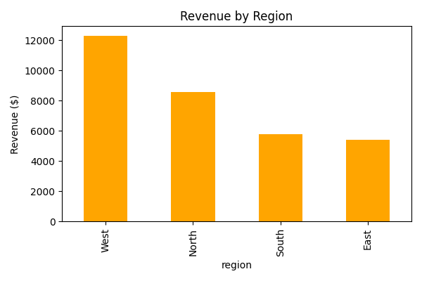
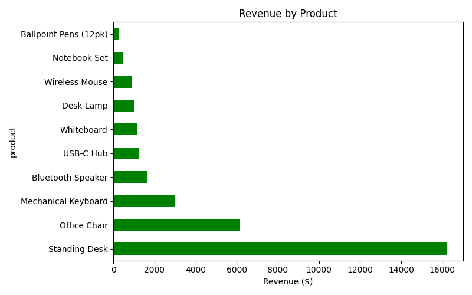
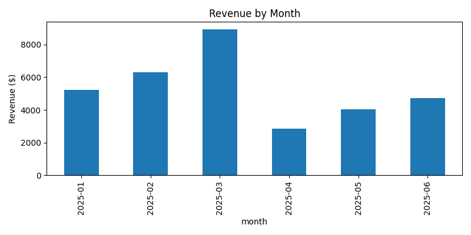

# Sales Data Analysis Report

**Dataset:** `sales_data.csv` — 100 synthetic sales order records
**Period covered:** 2025-01-01 to 2025-06-30
**Source files:** `generate_data.py` (dataset), `analysis.py` (analysis)

## 1. Executive Summary

- **Total orders:** 100
- **Total revenue:** $32,067.92
- **Average order value:** $320.68
- **Total units sold:** 434
- **Top region by revenue:** West ($12,304.86)
- **Top category by revenue:** Furniture ($23,348.65)
- **Best-selling product by revenue:** Standing Desk ($16,199.46)

## 2. Revenue by Region

| Region | Revenue ($) |
|--------|------------:|
| West   | 12,304.86 |
| North  | 8,566.34 |
| South  | 5,764.00 |
| East   | 5,432.72 |

The West region generated the most revenue, more than double the East region, which lagged behind all others.

## 3. Revenue by Category

| Category    | Revenue ($) |
|-------------|------------:|
| Furniture   | 23,348.65 |
| Electronics | 6,818.27 |
| Stationery  | 1,901.00 |

Furniture dominates revenue (73% of total), driven largely by high-ticket items like Standing Desks and Office Chairs, even though these are lower-volume purchases than Electronics or Stationery.

## 4. Revenue by Product

| Product               | Revenue ($) |
|-----------------------|------------:|
| Standing Desk         | 16,199.46 |
| Office Chair          | 6,149.59 |
| Mechanical Keyboard   | 2,999.50 |
| Bluetooth Speaker     | 1,639.59 |
| USB-C Hub             | 1,259.64 |
| Whiteboard            | 1,170.00 |
| Desk Lamp             | 999.60 |
| Wireless Mouse        | 919.54 |
| Notebook Set          | 467.48 |
| Ballpoint Pens (12pk) | 263.52 |

The Standing Desk alone accounts for roughly half of Furniture revenue and ~50% of total revenue, making it the single most important SKU in this dataset.

## 5. Monthly Revenue Trend

| Month   | Revenue ($) |
|---------|------------:|
| 2025-01 | 5,211.72 |
| 2025-02 | 6,316.27 |
| 2025-03 | 8,937.58 |
| 2025-04 | 2,862.82 |
| 2025-05 | 4,024.47 |
| 2025-06 | 4,715.06 |

Revenue peaked in March and dropped sharply in April before partially recovering in May and June.

## 6. Payment Methods

| Method        | Revenue ($) |
|---------------|------------:|
| PayPal        | 14,673.92 |
| Debit Card    | 7,665.26 |
| Bank Transfer | 6,153.73 |
| Credit Card   | 3,575.01 |

PayPal is the most-used payment method by revenue share (46%).

## 7. Top 5 Customers by Spend

| Customer         | Total Spend ($) |
|-------------------|----------------:|
| Mia Khan          | 2,408.91 |
| Ken Nguyen        | 2,399.92 |
| Nora Patel        | 1,799.94 |
| Isabella Garcia   | 1,799.93 |
| Noah Silva        | 1,551.80 |

## 8. Notes

- This dataset is synthetically generated (see `generate_data.py`, seeded for reproducibility) for demonstration purposes.
- Full numeric summary is available in `summary.json`; charts are in the `charts/` folder.
